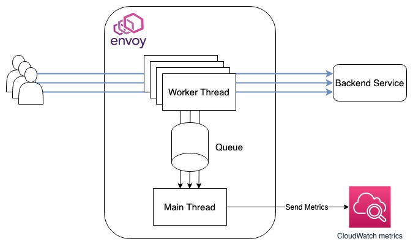

# AWS CloudWatch Proxy-Wasm
🚧 Experimental Project 🚧

AWS CloudWatch Proxy-Wasm (ACPW) sends the request metric to Amazon CloudWatch Metrics using Wasm module.



## Usage (local)
### 1. Get AWS credential
ACPW sends metrics to CloudWatch Metrics. In order to do that, you need to get access key ID and secret access key. The following policy is minimal one to work this project.

```json
{
    "Version": "2012-10-17",
    "Statement": [
        {
            "Effect": "Allow",
            "Action": "cloudwatch:PutMetricData",
            "Resource": "*"
        }
    ]
}
```

### 2. Install TinyGo
https://tinygo.org/getting-started/install/

### 3. Build Wasm modules

```console
$ make build-all
```

After executing the command above, please make sure the root directory has `sender.wasm` and `receiver.wasm`

### 4. Start project

```console
$ export ACPW_AWS_ACCESS_KEY_ID=[access key ID you got step1]
$ export ACPW_AWS_SECRET_ACCESS_KEY=[secret access key you got step1]
$ docker-compose up
```

### 5. Test

```console
➜ curl localhost:18000/test -H "Host: example.com"
OK
```

After executing the command above, you can confirm metrics on CloudWatch metrics.

```console
$ aws cloudwatch list-metrics --namespace AWSCloudWatchProxyWasm-dev
```

## Configuration
### Sender

|Name|Required|Description|
|-------|---------|-----|
| `receiver_vm_id` | ✔ | VM ID of receiver |
| `match_hosts` | | Hosts for sending metrics. e.g. example.com |

example

```
{
  "receiver_vm_id": "receiver",
  "match_hosts": ["example.com"]
}
```

### Receiver

|Name|Required|Description|
|-------|---------|-----|
| `cloud_watch_region` | ✔ | Region of CloudWatch |
| `cloud_watch_cluster_name` | ✔ | Cluster Name of CloudWatch |
| `aws_access_key_id` | ✔ | AWS Access Key ID. You can set it using environment variable `ACPW_AWS_ACCESS_KEY_ID` |
| `aws_secret_access_key` | ✔ | AWS Secret Access Key. You can set it using environment variable `ACPW_AWS_SECRET_ACCESS_KEY` |
| `http_request_timeout_millisecond` | | The timeout for requesting to CloudWatch API |
| `metric_namespace` | | The namespace of CloudWatch metrics |
| `metric_name` | | | The metric name of CloudWatch metrics |
